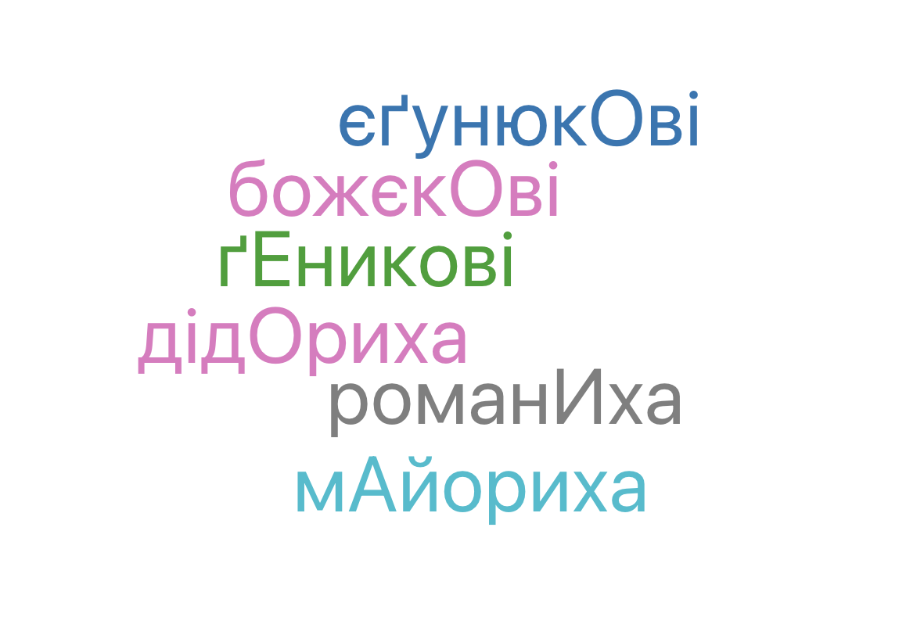

# My Genealogy
gen-tags?
gen-clouds?
genealogy-clouds?
genealogy-tags?
gen-data?
gen-domain?

Genealogy related projects sandbox

Somehow relates to [AgriKoła](https://github.com/alundiak/AgriKola) - project where I try to build matrix of surnames based on roots and suffixes relying heavily on data from https://ridni.org.

Migrated from [gen-&-gen](https://github.com/alundiak/gen-and-gen) project.

Is related to [My DNA](https://github.com/alundiak/my-dna) project.


More TBD

## FamilyTree Sunburst fan chart
aka Lineage small sunburst

https://github.com/bkrem/react-d3-tree
https://bkrem.github.io/react-d3-tree/
CAN BE used for SNP-like tree


Very similar look and data of Sunburst as before
https://github.com/plouc/nivo
https://nivo.rocks/sunburst/
https://nivo.rocks/storybook/?path=/docs/sunburst--docs


## Locations tag-cloud

TBD

## Surnames tag-cloud
TBD

## Nicknames aka Vulgo names tag cloud

UA: Прізвиська, або вуличні назви цілих родин в генеалогії дуже важливі дані. Досліджуючи генеалогію села Молодків, в мене зібралось даних про біля 200 різних прізвиськ, етимологія яких в більшості випадків зрозуміла, але деколи є дуже цікаві, етимологія яких не одразу зрозуміла. І аж після кількох років дослідження можна врешті зрозуміти суть.




## Genealogy (metrical records) sources

- https://genealodzy.pl/ (user alundiak)
- https://metryki.genealodzy.pl/
- https://geneszukacz.genealodzy.pl/
- https://szukacz.genealodzy.pl/

## TechStack


Used Vite + React + SWC setup. Bootstrapped via:

```sh
npm create vite@latest new-gen-gen -- --template react-swc-ts
```
